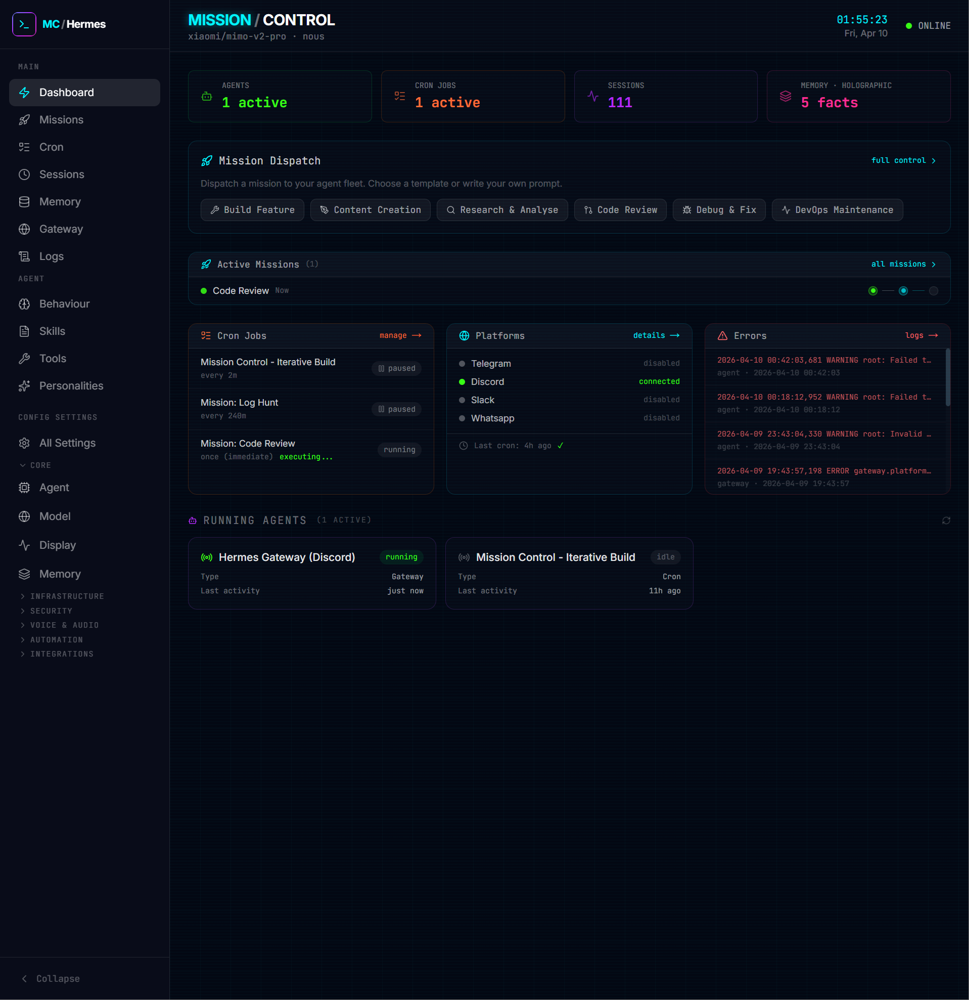

# Hermes Mission Control

A command centre dashboard for [Hermes Agent](https://github.com/NousResearch/hermes-agent). Monitor your agent fleet, dispatch missions, manage configurations, and control everything from one place.



---

## Features

| Feature | Description |
|---------|-------------|
| **Dashboard** | Live stats, active missions, system health, collapsible mission dispatch |
| **Missions** | 29 built-in templates across 8 categories, with 8 specialist agent profiles |
| **Agent Profiles** | QA, DevOps, SWE, Data, Data Science, Ops, Creative, Support specialists |
| **Cron Manager** | Schedule, edit, and monitor recurring tasks (1m to 7d intervals) |
| **Agent Behaviour** | Profile-centric editor with personality selection, file editing per profile |
| **Config Editor** | Full config.yaml editing with 27 sections + HERMES.md + .env viewer |
| **Session Browser** | View conversation transcripts across all gateways |
| **Memory** | Hindsight (semantic search) or Holographic (structured facts) memory management |
| **Skills Manager** | Profile-aware skills with inline toggle switches and content viewer |
| **Tools Manager** | Profile-aware toolsets with per-tool toggles per platform |
| **Gateway** | Monitor platform connections (Discord, Telegram, etc.) |
| **Logs** | Browse recent log entries for quick triage |
| **Story Weaver** | Collaborative AI fiction — create worlds, write chapters, build stories |

---

## Quick Start

```bash
# Clone and install
git clone https://github.com/Daniel-Parke/hermes-mission-control.git ~/mission-control
cd ~/mission-control
bash scripts/install.sh
```

The installer will:
1. Check prerequisites (Node.js 18+, Hermes agent)
2. Install dependencies and build
3. Create 8 specialist agent profiles
4. Optionally set up Hindsight memory (PostgreSQL + semantic search)

The dashboard will be available at `http://localhost:3000`.

---

## Prerequisites

- **Node.js** 18+
- **Hermes Agent** installed at `~/.hermes/` (run `hermes update` first)

### Optional: Hindsight Memory

For long-term memory with semantic search, install Hindsight during setup:

```bash
# During install — answer "y" when prompted
bash scripts/install.sh

# Or install on existing setup
bash scripts/setup-hindsight.sh
```

Hindsight requires:
- PostgreSQL with pgvector extension
- ~2GB disk for Python packages (PyTorch, transformers)
- Sudo access for PostgreSQL installation

---

## Architecture

```
mission-control/
├── src/
│   ├── app/                    # Next.js pages + API routes
│   │   ├── api/                # REST endpoints ({ data?, error? } envelope)
│   │   ├── agent/              # Behaviour, Tools pages
│   │   ├── skills/             # Skills manager
│   │   ├── memory/             # Memory browser (provider-aware)
│   │   ├── config/             # Config editor (27+ sections)
│   │   ├── missions/           # Mission dispatch + tracking
│   │   ├── cron/               # Cron job manager
│   │   ├── sessions/           # Session browser
│   │   └── recroom/            # Creative activities
│   ├── components/             # React components
│   │   ├── memory/             # HindsightBrowser, HolographicBrowser
│   │   ├── layout/             # Sidebar, PageHeader
│   │   └── ui/                 # Button, Card, Modal, Badge, etc.
│   ├── lib/                    # Shared utilities
│   │   ├── memory-providers/   # Memory provider abstraction layer
│   │   ├── config-schema.ts    # Config section definitions
│   │   ├── hermes.ts           # Path constants, config helpers
│   │   └── utils.ts            # timeAgo, formatBytes, parseSchedule
│   └── types/                  # TypeScript interfaces
├── scripts/                    # Shell scripts
│   ├── install.sh              # One-command installer (with optional Hindsight)
│   ├── setup.sh                # Post-clone setup (npm install, build)
│   ├── setup-hindsight.sh      # Standalone Hindsight installer
│   ├── restart.sh              # Safe server restart (no nohup)
│   ├── safe-restart.sh         # Minimal restart script
│   ├── update.sh               # Git pull + build + restart
│   └── backup-hermes-config.sh # Config backup
└── data/                       # Mission + template JSON files
```

---

## Memory Providers

Mission Control supports multiple memory backends:

| Provider | Type | Features | Setup |
|----------|------|----------|-------|
| **Hindsight** | Knowledge graph | Semantic search, reflection, entities, directives | `bash scripts/setup-hindsight.sh` |
| **Holographic** | SQLite | Structured facts, trust scoring, categories | `hermes plugins install hermes-memory-store` |
| **None** | — | No persistent memory | Default if nothing configured |

The dashboard automatically detects your configured provider and adapts the Memory page accordingly. If no provider is configured, it shows an informative notice.

---

## Agent Profiles

8 specialist profiles are created during install:

| Profile | Focus | Skills |
|---------|-------|--------|
| QA Engineer | Testing, bug reproduction | 75 enabled |
| DevOps Engineer | Infrastructure, CI/CD | 72 enabled |
| SWE Engineer | Software development | 74 enabled |
| Data Engineer | Pipelines, ETL | 74 enabled |
| Data Scientist | ML/AI research | 75 enabled |
| Ops Director | Operations, coordination | 85 enabled |
| Creative Lead | Content, design | 88 enabled |
| Support Agent | User support, triage | 74 enabled |

Each profile has its own SOUL.md, AGENTS.md, USER.md, MEMORY.md, and skill/tool configuration. All profiles share the main agent's API keys.

---

## Scripts

| Script | Purpose |
|--------|---------|
| `install.sh` | One-command installer (fresh or reinstall) |
| `setup.sh` | Post-clone setup (npm install, build, test) |
| `setup-hindsight.sh` | Standalone Hindsight memory installer |
| `restart.sh` | Safe server restart (builds, no nohup) |
| `safe-restart.sh` | Minimal restart (kill + start) |
| `update.sh` | Pull from main, build, restart |
| `backup-hermes-config.sh` | Backup/restore Hermes config |

---

## Development

```bash
cd ~/mission-control

# Development (hot reload)
npm run dev

# Production build
npm run build

# Start production server
npm run start:network    # LAN accessible
npm run start            # localhost only

# Run tests
npm test
```

---

## Configuration

Mission Control reads from `~/.hermes/config.yaml` — it never writes to this file directly.

Key config sections:
- `memory.provider` — Memory backend (hindsight, holographic, none)
- `plugins.hindsight` — Hindsight server configuration
- `platform_toolsets` — Which tools are available per platform
- `skills.disabled` — Skills to exclude from the prompt

---

## API

All API routes follow the `{ data?, error? }` envelope pattern:

```typescript
// Success
{ data: { profiles: [...] } }

// Error
{ error: "Profile not found" }
```

Error logging: all catch blocks call `logApiError(route, context, error)`.

---

## Requirements

- Node.js 18+
- Hermes Agent installed at `~/.hermes/`
- (Optional) PostgreSQL + pgvector for Hindsight memory
- (Optional) Python 3.11 + venv for Hindsight

---

## License

MIT
