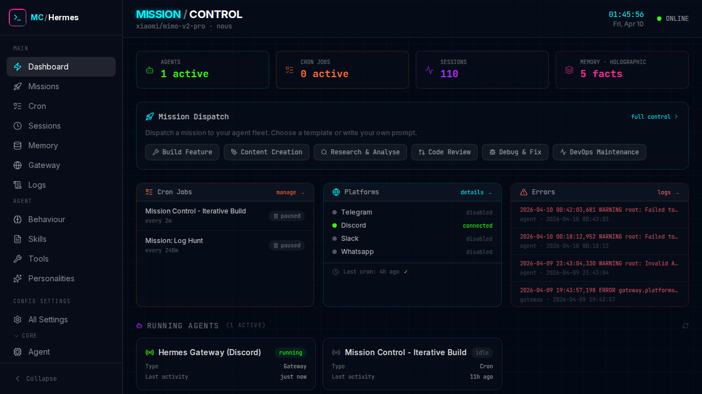
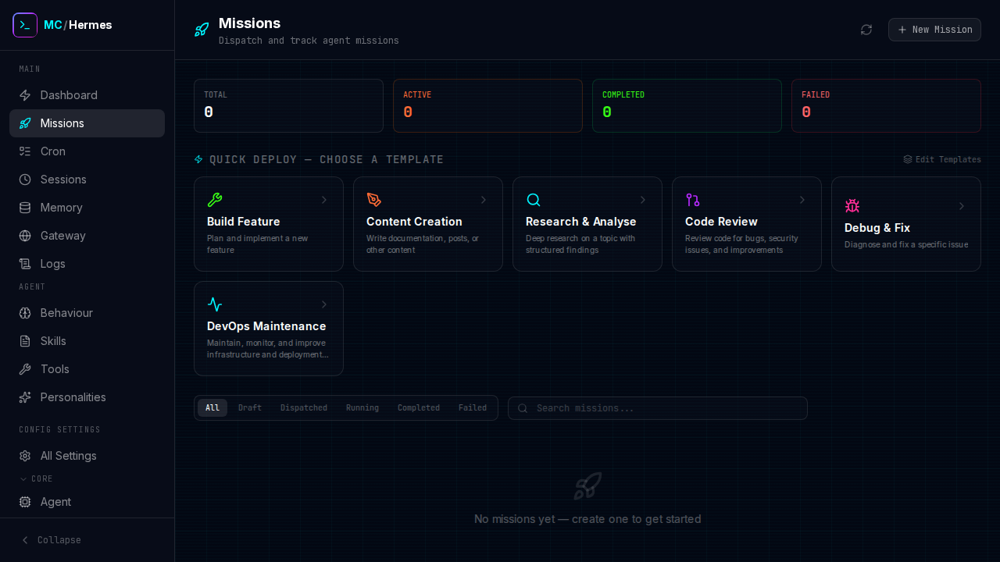
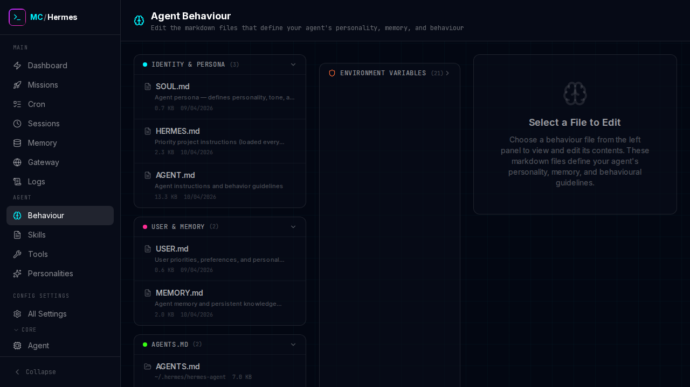
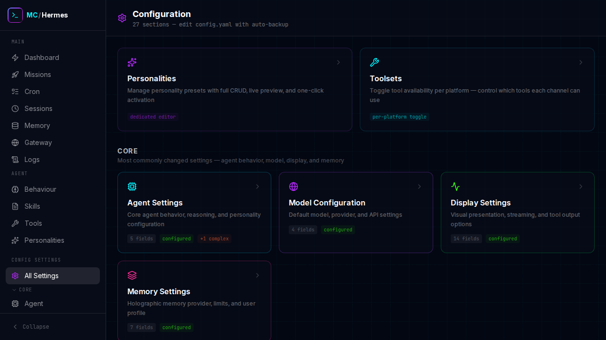

# Hermes Mission Control

A command centre dashboard for [Hermes Agent](https://github.com/NousResearch/hermes-agent). Monitor your agent fleet, dispatch missions, manage configurations, and control everything from one place.



## Features

**Dashboard** — Live stats, active missions, system monitor, running agents

**Missions** — Dispatch and track agent missions with 6 built-in templates

**Agent Behaviour** — Edit SOUL.md, HERMES.md, USER.md, MEMORY.md, AGENTS.md, and masked .env

**Config Editor** — Full config.yaml editing with 27 sections and auto-backup

**Cron Manager** — Schedule and monitor recurring tasks

**Session Browser** — View conversation transcripts

**Memory CRUD** — Manage holographic memory facts

**Skills Browser** — Browse and view installed skills

**Tools Manager** — Toggle toolsets per platform (Discord, Telegram, CLI, etc.)



## Prerequisites

- **Node.js** 18 or later
- **Hermes Agent** installed and configured at `~/.hermes/`

## Quick Start

```bash
git clone https://github.com/Daniel-Parke/hermes-mission-control.git ~/mission-control
cd ~/mission-control
bash setup.sh
npm run start
```

The dashboard will be available at `http://localhost:3000`.

## Development

```bash
npm run dev           # Start dev server with hot reload
npm run build         # Production build
npm run test          # Run test suite (20 tests)
npm run start         # Production server
npm run start:network # Accessible on LAN
```

## Configuration

Mission Control reads from your existing Hermes installation. No additional configuration is needed if Hermes is already set up.

**Data storage:** Missions and custom templates are stored at `~/.hermes/mission-control/data/`. This keeps your data portable — it travels with your Hermes config, not the app directory.

**Environment variables** (optional, in `.env`):

| Variable | Default | Description |
|----------|---------|-------------|
| `HERMES_HOME` | `~/.hermes` | Path to Hermes home directory |
| `PORT` | `3000` | Server port |

## Screenshots





## Architecture

- **Framework:** Next.js 16 (App Router) + TypeScript + Tailwind CSS
- **Data:** Direct file I/O on `~/.hermes/` + SQLite for memory
- **API:** RESTful routes under `/api/`
- **State:** React hooks (no external state management)
- **YAML:** js-yaml for all config parsing

All API routes import paths from `src/lib/hermes.ts` for consistency. The app reads from `~/.hermes/` but never writes to `config.yaml` directly.

## Related Repositories

| Repo | Purpose |
|------|---------|
| [hermes-mission-control](https://github.com/Daniel-Parke/hermes-mission-control) | This dashboard |
| [hermes-agent](https://github.com/Daniel-Parke/hermes-agent) | Full agent backup (code + config + skills) |
| [hermes-config](https://github.com/Daniel-Parke/hermes-config) | Agent identity backup (config, skills, memory) |

## License

MIT
