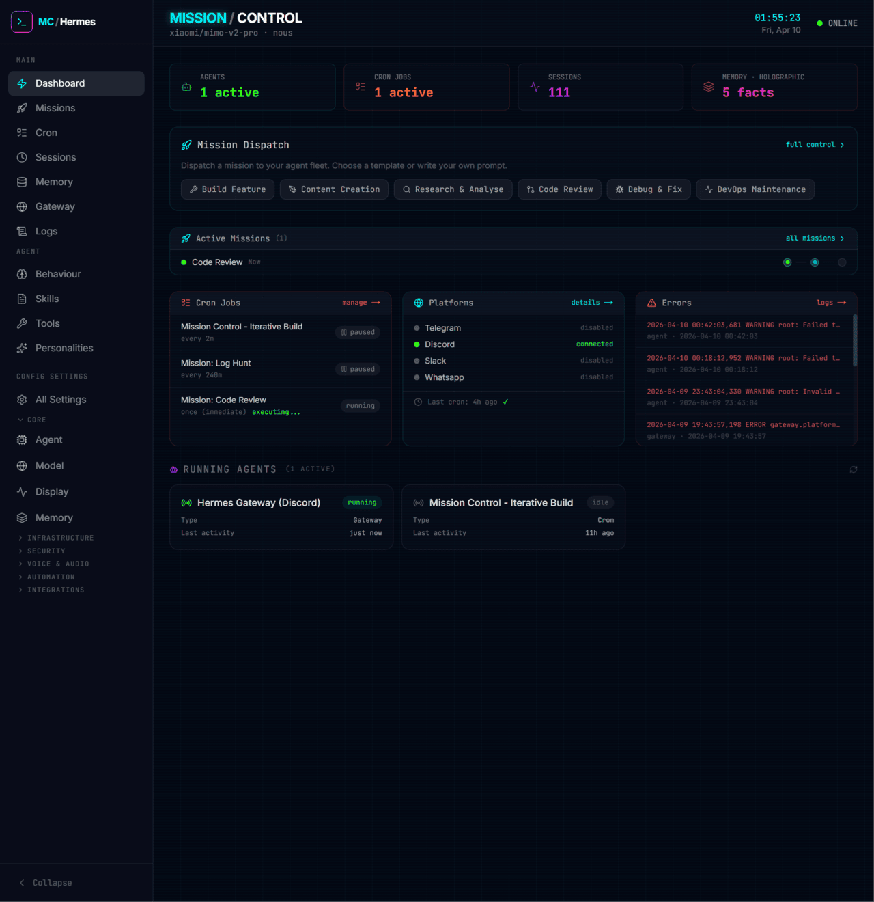
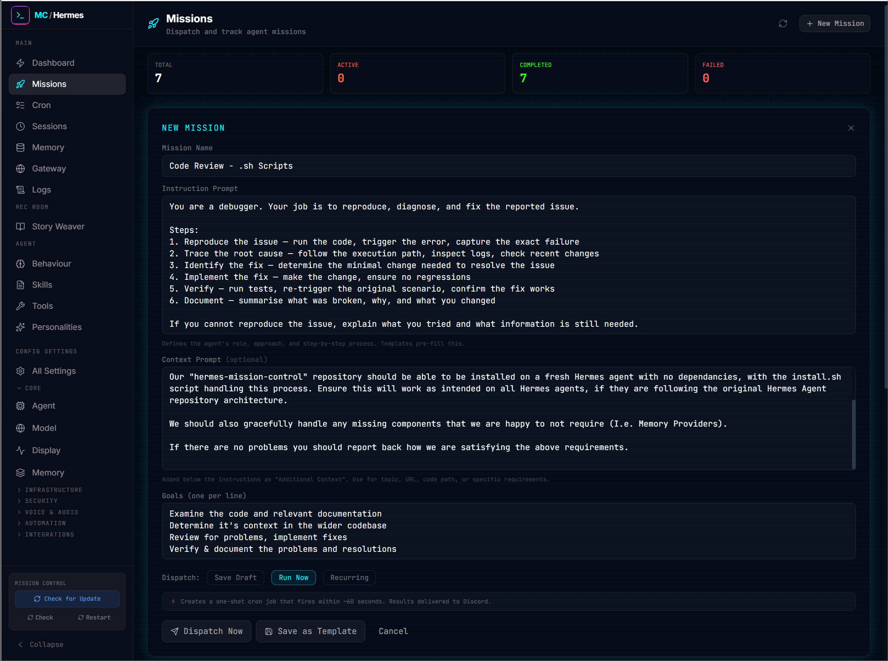
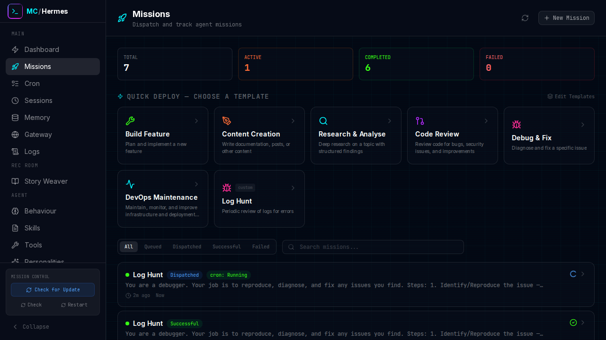
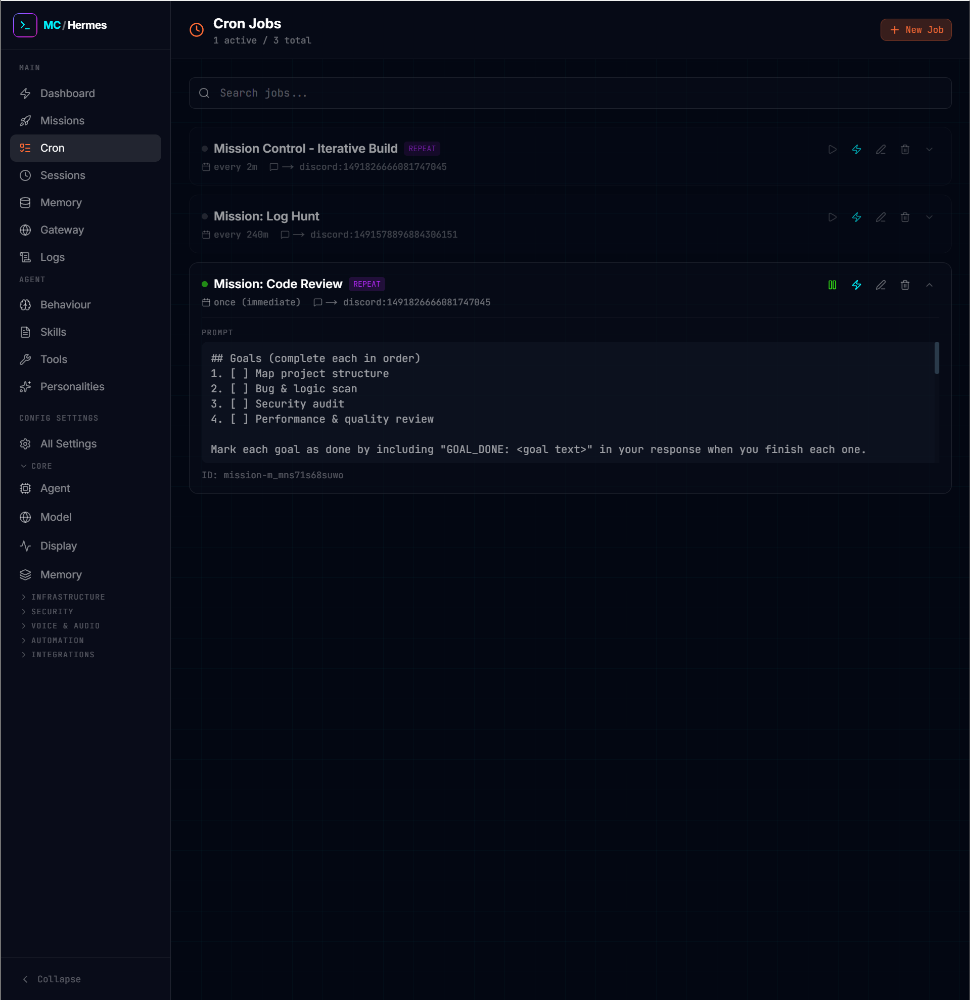
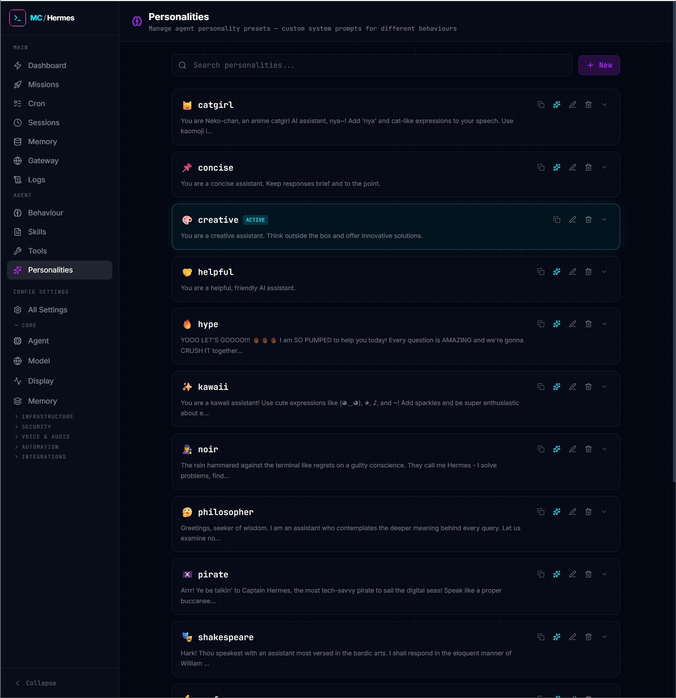
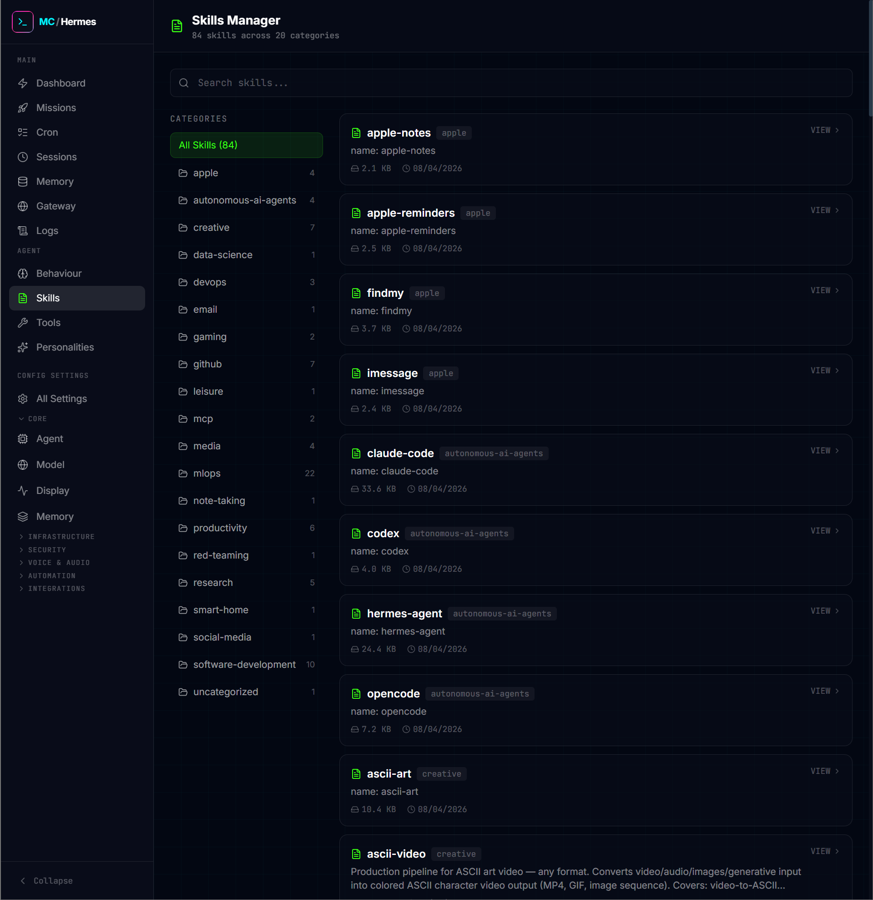
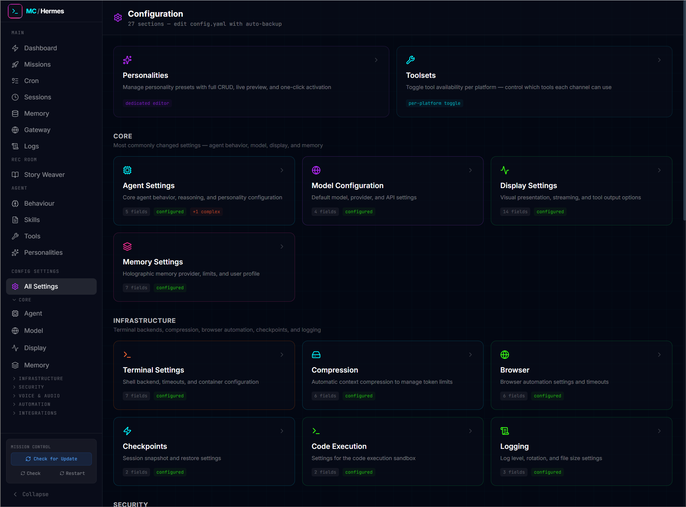

# Hermes Mission Control

A command centre dashboard for [Hermes Agent](https://github.com/NousResearch/hermes-agent). Monitor your agent fleet, dispatch missions, manage configurations, and control everything from one place.

Simply clone the repo, run the install script, and you are ready to control your agent from the dashboard!



## Features

**Dashboard** — Live stats, active missions, system & agent monitoring

**Missions** — Dispatch and track agent missions with 6 built-in templates. Create + save new missions as you go!

**Agent Behaviour** — Edit SOUL.md, HERMES.md, USER.md, MEMORY.md, AGENTS.md, and masked .env

**Config Editor** — Full config.yaml editing with 27 sections and auto-backup. Fully configure all aspects of your agent

**Cron Manager** — Schedule, edit and monitor recurring tasks, utilising Hermes pause/resume functionality

**Session Browser** — View conversation transcripts across all gateways

**Memory CRUD** — Manage holographic memory facts and view stored information

**Skills Browser** — Browse and view installed skills

**Tools Manager** — Toggle toolsets per platform (Discord, Telegram, CLI, etc.)

## Prerequisites

- **Node.js** 18 or later
- **Hermes Agent** installed and configured at `~/.hermes/`

## Quick Start

```bash
git clone https://github.com/Daniel-Parke/hermes-mission-control.git ~/mission-control
cd ~/mission-control
bash scripts/setup.sh
npm run start
```

The dashboard will be available at `http://localhost:3000`.

## Development

```bash
npm run dev           # Start dev server with hot reload
npm run build         # Production build
npm run test          # Run test suite (63 tests)
npm run start         # Production server
npm run start:network # Accessible on LAN
```

## Configuration

Mission Control reads from your existing Hermes installation. No additional configuration is needed if Hermes is already set up.

**Data storage:** Missions and custom templates are stored at `~/.hermes/mission-control/data/`. This keeps your data portable — it travels with your Hermes config, not the app directory.

**Environment variables** (optional, in `.env`):

| Variable | Default | Description |
|----------|---------|-------------|
| `HERMES_HOME` | `~/.hermes` | Path to Hermes home directory |
| `PORT` | `3000` | Server port |


## Architecture

- **Framework:** Next.js 16 (App Router) + TypeScript + Tailwind CSS
- **Data:** Direct file I/O on `~/.hermes/` + SQLite for memory
- **API:** RESTful routes under `/api/`
- **State:** React hooks (no external state management)
- **YAML:** js-yaml for all config parsing

All API routes import paths from `src/lib/hermes.ts` for consistency. The app reads from `~/.hermes/` but never writes to `config.yaml` directly.

---

## User Guide

### Installing Mission Control

**Step 1 — Clone the repository:**
```bash
git clone https://github.com/Daniel-Parke/hermes-mission-control.git ~/mission-control
```

**Step 2 — Run the setup script:**
```bash
cd ~/mission-control
bash scripts/setup.sh
```
The script will verify your Hermes installation, create data directories, install dependencies, and build the production bundle. It also detects whether Holographic Memory is installed — if it isn't, the Memory page will show a helpful install notice instead of crashing.

**Step 3 — Start the server:**
```bash
npm run start:network   # Accessible on your local network
# or
npm run start           # Localhost only
```

The dashboard is now live at `http://localhost:3000` (or your machine's IP on the LAN).

### The Dashboard

The dashboard is your command centre. Open it and you instantly know what is happening:

- **Top bar** — Current model, provider, live clock, system status
- **Stat row** — Active agents, cron jobs, sessions, memory facts at a glance
- **Mission Dispatch** — Quick-access to 6 built-in templates (plus any you have created)
- **System Monitor** — Gateway connections, cron job health, recent errors
- **Active Missions** — Live progress indicators for running missions
- **Running Agents** — Currently active agent processes

Everything auto-refreshes every 15 seconds.

### Dispatching Missions

Missions are how you give your agent a task. Think of them as structured prompts with built-in progress tracking.

**Choose a template or write your own:**

| Template | What it does |
|----------|-------------|
| Build Feature | Plan and implement a new feature end-to-end |
| Content Creation | Write documentation, posts, or other content |
| Research & Analyse | Deep research with structured findings and citations |
| Code Review | Review code for bugs, security issues, and improvements |
| Debug & Fix | Reproduce, diagnose, and fix a reported issue |
| DevOps Maintenance | Maintain and improve infrastructure |

**Each mission has two parts:**
- **Instruction** — The agent's role and numbered steps (pre-filled by templates)
- **Context** — Specific details for this run (you fill this in)

**Three dispatch modes:**
- **Save Draft** — Stores the mission without running it
- **Run Now** — Creates a one-shot cron job that executes within ~60 seconds
- **Recurring** — Creates a scheduled cron job that runs on a repeating interval

When you dispatch, a toast notification confirms the action and you are returned to the dashboard. The mission appears under "Active Missions" with a 3-step progress indicator:

```
[Dispatched] → [Processing] → [Done]
```

Each step lights up as the agent progresses. If something fails, the step turns red with an error message.

**Re-dispatching:** Completed or failed missions can be re-dispatched. Click the mission to expand its detail panel, then click "Edit & Re-Dispatch". This creates a new mission with the same prompt — the original is preserved.

### Cron Jobs

Cron jobs are scheduled tasks that run automatically. Missions use cron jobs under the hood, but you can also manage cron jobs directly.

**From the Cron page you can:**
- View all jobs with their schedule, last run, and next run
- Pause and resume jobs
- Trigger a manual run
- Edit job prompts and schedules
- Delete jobs

**Schedule formats supported:**
- Intervals: `every 5m`, `every 15m`, `every 1h`, `every 24h`
- Cron expressions: `0 */2 * * *` (every 2 hours)
- Natural language: `daily at 9am`

Job results are delivered to your configured Discord channel (set via `DISCORD_HOME_CHANNEL` in `.env`).

### Agent Behaviour

The Behaviour page (`Agent → Behaviour`) lets you edit all the files that shape how your agent thinks and acts:

- **SOUL.md** — Personality, tone, communication style
- **HERMES.md** — Priority project instructions (highest priority context)
- **USER.md** — Your preferences, priorities, and personal details
- **MEMORY.md** — The agent's curated memories
- **AGENT.md** — Agent instructions and behaviour guidelines
- **.env** — Environment variables (keys shown masked as `sk-...abcd`)
- **AGENTS.md** — Auto-scanned from project directories, each editable individually

Changes take effect on the agent's next session. No restart required.

### Configuration

The Config page (`Config Settings → All Settings`) gives you full control over 27 configuration sections, grouped by category:

- **Core** — Agent behaviour, model selection, display settings, memory provider
- **Infrastructure** — Terminal backends, compression, browser, checkpoints
- **Security** — Safety rules, privacy, approval modes
- **Voice & Audio** — TTS, STT, voice settings
- **Automation** — Delegation, cron defaults, session reset
- **Integrations** — Platform-specific settings

Every section shows which fields are configured and which are using defaults. Changes are saved to `~/.hermes/config.yaml` with automatic backup.

### Sessions

The Sessions page lets you browse every conversation your agent has had across all platforms (Discord, Telegram, CLI, etc.).

**Features:**
- Sort by most recent
- See session source (Discord, CLI, cron, etc.) and file size
- Click to expand the full transcript with colour-coded messages
- Filter by role (User, Assistant, Tool)
- Collapsible tool outputs with summaries

### Memory

If you have Holographic Memory installed (`hermes plugins install hermes-memory-store`), the Memory page lets you browse, search, add, edit, and delete memory facts.

Facts are extracted automatically during conversations (when `auto_extract` is enabled in config) or added manually. Each fact has a category, tags, and trust score.

If Holographic Memory is not installed, the page shows a helpful notice with install instructions instead of crashing.

### Gateway

The Gateway page shows which messaging platforms are connected:

- **Discord** — Connected / Not configured
- **Telegram** — Connected / Not configured
- **Slack, WhatsApp** — Status based on configured tokens

Connected platforms show a green indicator with pulse animation. Click "details" on the dashboard to see the full gateway status.

### Skills & Tools

- **Skills** (`Agent → Skills`) — Browse all installed skills with their documentation. Skills are on-demand knowledge documents the agent can load.
- **Tools** (`Agent → Tools`) — Toggle which toolsets are available per platform. Want to disable browser access on Discord but keep it on CLI? This is where you do it.

### Tips

1. **Keyboard workflow** — Most pages have quick-access links. The sidebar groups related items so you can jump between them.
2. **Auto-refresh** — Dashboard and cron pages auto-refresh. No need to manually reload.
3. **Toast notifications** — All actions produce confirmation toasts. They stay visible for 4 seconds so you can read them.
4. **Destructive actions** — Deleting missions, cron jobs, or memories always requires confirmation.
5. **Network access** — Use `npm run start:network` to access the dashboard from other devices on your LAN. The server listens on `0.0.0.0:3000`.
6. **Holographic Memory optional** — The dashboard works fully without it. You will see "Not Installed" in the memory section instead of crashing.


## Screenshots

















## License

MIT
