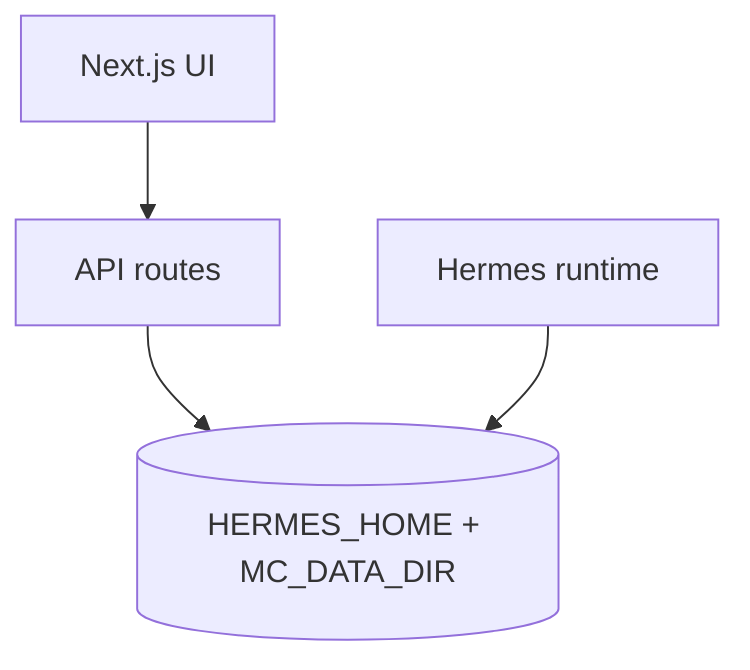

# Mission Control platform vision

Mission Control is the **Next.js control plane** for [Hermes Agent](https://github.com/NousResearch/hermes-agent): missions, cron, configuration, sessions, memory, and operator workflows. Execution still lives in **Hermes** (Python gateway, cron scheduler). This app edits `jobs.json`, mission JSON, and `config.yaml` through audited APIs.

## Architecture (layers)

- **`HERMES_HOME`** (`~/.hermes`): `config.yaml`, `cron/jobs.json`, sessions, skills, logs.
- **`MC_DATA_DIR`** (default `~/mission-control/data`): missions, templates, operations, task lists, packages, workspaces registry, stories, Rec Room data.

## Scheduling contract

- Cron jobs are rows in **`HERMES_HOME/cron/jobs.json`**. Mission Control appends with a file lock compatible with Hermes.
- Recurring jobs use **`repeat.times: null`** for infinite runs (Hermes canonical).
- **`parseSchedule`** in `src/lib/utils.ts` accepts intervals, ISO one-shots, and five- or six-field cron strings; unknown input is **`invalid`** and rejected on user-facing routes.

## Major features (roadmap alignment)

| Area | Role |
|------|------|
| Model / provider | `GET`/`PUT /api/config/model` — Zod-validated updates, masked keys, audit. |
| Operations | Multi-step records on disk; **Dispatch step** saves a mission from a built-in template id; advance is manual unless you add a Hermes coordinator. |
| Task lists | Definitions under `task-lists/`; recommended execution is **one coordinator cron job** in Hermes (see nested Hermes docs). |
| Packages | JSON bundles under `packages/` for templates / list ids / profile names. |
| Workspaces | Allowlisted absolute paths under home, `HERMES_HOME`, or `MC_DATA_DIR`. |
| Command Room | MVP shell; chat/dual-agent needs gateway HTTP/WebSocket surfaces from Hermes. |

## Security

- Mutating routes use **`MC_API_KEY`** when set (`src/lib/api-auth.ts`).
- Config writes use **whitelisted sections**; model updates go through **`/api/config/model`**.
- Workspace paths are validated with **`resolveAllowedWorkspacePath`** (`src/lib/path-security.ts`).

## Related docs

- [MIGRATION.md](../MIGRATION.md) — default data directory change.
- [DEPLOY.md](DEPLOY.md) — host, port, TLS, Docker.
- [HERMES_CONFIG_INTEGRATION.md](HERMES_CONFIG_INTEGRATION.md) — external `hermes-config` repo checklist.
