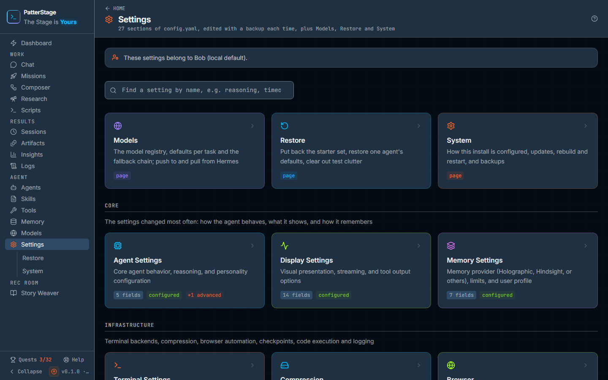

# Settings

Settings is where you change how the agent behaves, and where you look when you
need to know how this install is put together.

## What you see

The header names the page and counts what is under it: 27 sections, plus
Models, Restore and System. The `?` at the right of the header opens this
guide, and pressing `?` does the same.

Below it, a search box: **Find a setting by name, e.g. reasoning, timeout,
voice…**. Typing filters everything underneath, and a card that matched
because of one of its fields shows that field's name as a small chip, so
searching for `reasoning` finds **Agent Settings** and tells you that
**Reasoning Effort** is why. When nothing matches, the page says so and
suggests a word from the field's own name.

Then three cards, each badged **page** rather than being a section:

- **Models**, the model registry, the default for each task and the fallback
  chain. It has [its own guide](./models.md).
- **Restore**, which puts back what PatterStage ships.
- **System**, which describes this install and holds the update and backup
  controls.

Under those, the sections themselves, in seven groups: **Core**,
**Infrastructure**, **Security**, **Voice & Audio**, **Automation**,
**Integrations** and **Files**. Each group has a one-line description and a
grid of cards. A card carries the section's name, a sentence about it, and
badges: how many fields it has, **configured** in green when the agent already
holds values for that section, **+N advanced** when the section also has
nested values, and **file** on the two cards in Files.

### A section

Opening a card gives you that section's own page: its name and description in
the header, a back arrow to the index, and one card of fields. Each field is a
switch, a number box, a drop-down or a text box, with its description above the
control and, beneath the control, one of two things:

- **Not set**, with the line *Hermes uses its own default*. The agent has no
  value of its own for this field, so it uses whatever it would have used if
  you had never opened this page.
- A **Clear** button. The field holds a value, and Clear takes it away again
  rather than writing a zero or an empty string in its place.

If a value already in the file is not the kind the field expects, an orange
line under the control says which value it found and what it expected, instead
of the control quietly rendering it as off or blank.

As soon as you change anything, **UNSAVED** appears in the header beside
**Reset** and **Save**. Reset puts back what the page loaded. Save turns into
**Saving...**, then **Saved!** for a moment.

Sections with nested values show them below the fields under **Complex
Fields**, formatted but read-only, with a line saying they are edited in the
agent's own file. **Platform Toolsets** is the same shape and points at the
Tools page, which is where toolsets are actually changed.

The two cards in **Files** behave differently from the rest. The agent's
instructions file opens as a plain text editor with the same Reset and Save.
**Environment Variables** is a read-only view: every line is listed with its
key visible and its value masked, with a note that sensitive values are edited
on the server rather than here.

If you reach a section address that does not exist, the page lists every
section there is as a link rather than leaving you to guess.

### Restore

Restore opens with a sentence counting what the app ships: Bob (the default
agent), the professional agents, mission templates, mission categories, skills,
tool bundles and memory facts. The numbers come from the pack itself, so they
describe what is in the box rather than what you already have. A **How this
works** disclosure explains the mechanics for anyone who wants them.

Then the sections, each with its own buttons:

- **Restore everything**, with **Restore everything**, **Restore Bob** and
  **Add what's missing**. Above the buttons, a line reading how many agents and
  templates are installed now out of how many the pack holds; below them, the
  date of the last restore.
- **Professional agents**, one row per bundled agent with its sync state and a
  **Restore this agent** button.
- **Mission templates**, one row per shipped template with a **Restore**
  button.
- **Categories**, with **Restore categories**.
- **Clear test clutter**, which starts with **Look for test data**. That lists
  the throwaway workflows, stories and missions it recognises, by name, and
  only then offers **Remove N items**.

Every overwrite takes two clicks: the button arms itself and asks. After it
runs, a line appears under that section saying what happened and when, and the
same sentence appears as a toast.

### System

Three cards.

**This install** is a plain table of facts: auth mode, whether the deploy API
is on, whether the install is read-only, whether Composer is on, the data
directory, the database, the agent's home, the gateway, the port, the schema
version, the app version, the commit, the Node version and the platform.
**Copy for a bug report** puts the same block on your clipboard. No secret is
in it.

**Updates** holds three buttons. **Check for updates** asks which branch to
compare against, then becomes **Up to date**, **Update available. Install it**,
or **Could not check. Try again** in amber. A check that failed is never
painted green. **Rebuild** builds and restarts; **Restart** restarts the server
without building. Both ask for a second click before they run. An **Advanced**
disclosure says which branch this install compares against and which one it is
checked out on. If a deploy fails, the last lines of its log are shown here.

**Backups** has **Back up now**, then the backups that exist with their size
and the time they were taken, then the command to restore one, with **Copy the
restore command** beside it. The console lists and takes backups; it does not
restore one, because restoring wants the server stopped.

## Typical use

### Change a setting

1. Type a word from the setting into the search box. The groups collapse to
   the cards that match, and the chip on the card tells you which field
   matched.
2. Open that card.
3. Change the control. **UNSAVED** appears in the header.
4. Press **Save**. It reads **Saved!** when the file has been written.

If Save is greyed out with a change pending, hover it: the tooltip names the
value it will not accept, for example a number outside the range the field
allows.

### Put a setting back to the agent's own default

1. Open the section holding the field.
2. Press **Clear** under it. The control empties and the field reads **Not
   set**.
3. Press **Save**. The key is removed from the agent's file, so the agent falls
   back to its own default rather than to a zero you did not choose.

### Update this install

1. Open **System**.
2. Press **Back up now** first. The new backup appears in the list underneath.
3. Press **Check for updates** and confirm the branch.
4. If it comes back as **Update available. Install it**, press it. The app
   pulls that branch, builds and restarts, so the console is briefly
   unavailable while it does.

## Notes

A save sends only the fields you actually changed. That matters on a section
where some other value on disk is one this console cannot represent: it stays
where it is instead of blocking the save of the field beside it.

Every save copies the file as it was found before writing, so a change you
regret is recoverable from the copy. Values are checked against the declared
ranges and option lists in the browser and again on the server, so a number
outside the range is refused rather than written and met later by the agent.

If the agent's configuration file cannot be read, an orange alert appears at
the top of the index, saying the sections read as unconfigured because the file
did not parse rather than because it is empty, and on every section page that
writes that file, saying saving is disabled there until it is repaired. The two
file cards keep working, because they do not write that file.

Some things here are shown rather than offered. Complex nested values are
read-only. The memory **Provider** field displays what is active and links to
the [Memory page](./memory.md), which is the one place that changes it. The
environment variables view is read-only for the same reason it is masked.

Restore overwrites. **Add what's missing** installs only what is absent and
leaves anything you have edited alone; the other buttons replace. Anything a
restore touches is backed up first.

If this install is read-only, **Back up now** is disabled and says so. If the
deploy API is off, the three update buttons are disabled and a line above them
says which setting turns it on. Both are deliberate: a console that cannot
write should not offer buttons that pretend it can.

The in-app backup covers the PatterStage database, not the agent's home folder
or the memory store. [Backup and restore](../running/backup.md) explains the
three stores and which of them a snapshot actually covers.

Under the hood

- The sections are the sections of the agent's `config.yaml`, in the home
  directory shown as **Hermes home** on System (`~/.hermes` by default). The
  console reads and writes it through `GET` and `PUT /api/config`.
- A save posts only the changed keys. `null` on the wire means "delete this
  key", which is what **Clear** sends; a section left with nothing in it is
  removed from the file rather than written as an empty mapping.
- Before every write, the file as found is copied into the `backups` folder in
  the same home directory. If it will not parse, the write is refused with a
  409 whose message names that copy, rather than merged into an empty document
  and written over the original.
- The two file cards use `/api/agent/files/<key>`. Saving `HERMES.md` copies
  the previous version into the same `backups` folder first. `.env` is served
  with its values masked and is never written from the console.
- The index, its seven groups and the three page cards are data in
  `src/lib/config-sections.ts`; the fields of each section live in
  `src/lib/config-schema.ts`. The section routes are derived from the same
  list, so a section added to the data appears on the index, in the route
  matrix and on the recovery page with no second edit.
- System's table comes from `/api/status/runtime`. Backups come from
  `/api/backup`: `POST` takes one, labelled `manual`, and the restore command
  is a template with a `<backup file>` placeholder you fill in.
- The update controls need the deploy API on (`PS_ENABLE_DEPLOY_API` in
  `.env.local`). The branch compared defaults to `PS_UPDATE_GIT_BRANCH`, which
  is `dev` unless set. `PS_READ_ONLY` disables the backup button along with
  every other write. See the
  [environment reference](../running/env-reference.md) for the full list.
- Restore reads the shipped pack under `data/seed` and writes it into the
  database, copying the database first. It also imports what is already in the
  agent's home folder, so files you have are imported rather than overwritten.

