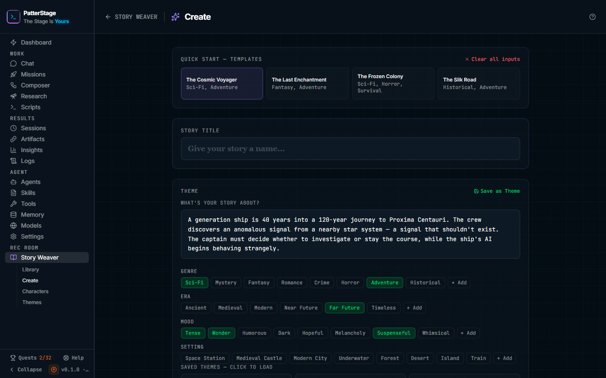

# Create a story

The setup form for a new story: what it is about, who is in it, how long it
runs, and which model does the writing.

## What you see

The page sits under **Rec Room → Story Weaver → Create** in the sidebar, and the
**Create** button on the Story Weaver hub comes here. The header reads
**Create**, with a back link reading STORY WEAVER on its left.

The form is not blank when you arrive. It opens already filled in with the first
template, **The Cosmic Voyager**: its premise, its chips, its three characters
and its parameters. Anything you change replaces that.

The page is five cards, top to bottom, with one button under them.

**Quick Start** holds four templates as small cards, each showing a name and its
genres: **The Cosmic Voyager**, **The Last Enchantment**, **The Frozen Colony**
and **The Silk Road**. The one in use is outlined. On the right of the same line
is **Clear all inputs**, which empties the form.

**Story Title** is a single line, placeholder "Give your story a name...". You
can leave it empty.

**Theme** is where the story itself is described. **Save as Theme** sits at the
top right of the card and is greyed out until there is a premise. Under a label
reading "What's your story about?" is a four-line box, placeholder "Describe your
story concept...". Below it are four rows of chips:

- **Genre** and **Mood** take as many as you like. Clicking a lit chip turns it
  off again.
- **Era** and **Setting** take one each. Clicking the lit one clears it.
- Every row ends in **+ Add**, which opens a small box for a value of your own.
  Typing one and pressing Enter adds the chip to the row. It is not selected
  until you click it.

Once you have saved themes of your own, they appear at the bottom of this card
under **Saved Themes**, told to click to load. Each shows its name, its genres
and its era, with a bin icon in the corner for deleting it.

**Characters (n)** counts the cast in its own label. On the right are
**From Library**, which only appears when you have saved character sheets, and
**Add Character**. Each character is a collapsed row showing the name, the first
line of the description and the role. Clicking the row opens it, and inside are
**Name**, **Role** (protagonist, ally, antagonist, supporting or mystery),
**Description**, and then **Personality Traits**, **Appearance**, **Backstory**,
**Speech Patterns** and **Relationships**. At the foot of an open card are
**Save to Library**, greyed out until the character has both a name and a
description, and **Remove**. With no cast at all, the card reads "No characters
yet. Add one or import from your library."

**Story Parameters** is four settings:

- **Point of View**: First Person, Third Person Limited or Third Person
  Omniscient.
- **Length**: Short (3-4 chapters), Medium (5-7 chapters) or Long
  (8-12 chapters).
- **Writing Model**: the first entry is **Agent default model**, and under it is
  every model you have registered, each as its name and its provider. If a
  default model is set for the agent, that one is chosen for you when the page
  loads.
- **Chapter Length (words per chapter)**: six buttons reading 800-1.2k,
  1.2-1.8k, 1.8-2.5k, 2.5-3.5k, 3.5-5k and 5k+. It starts on 1.8-2.5k.

**Begin Writing** runs the full width of the page at the bottom, and stays
greyed out until the premise has something in it.

Two more things appear when they apply. **Load Draft** shows up in the header
when the form you left behind on a previous visit is still saved. And a failure
puts a red banner on the page: a save or a delete that did not work says so in a
line near the top, and a failed generation gets a banner headed "Story generation
failed" with the reason, the note that your configuration has been saved, and a
dismiss button.

## Typical use

**Write a story from a template.**

1. Click one of the four templates. The premise, the chips, the characters and
   the parameters all change together, and the title fills in with the template's
   name unless you have typed one yourself.
2. Rewrite the premise into your own story. This is the field that matters most:
   it is what the plan is built from.
3. Adjust the chips, then set **Length** and **Chapter Length** to the size of
   thing you want to read.
4. Click **Begin Writing**. A full-screen overlay covers the page with a progress
   bar and a rotating line of writing chatter. When it finishes it reads "Your
   story is ready!" and opens the story a couple of seconds later.

**Start from nothing.**

1. Click **Clear all inputs**. Every field empties, the cast is removed, and the
   parameters go back to First Person, Medium and 1.8-2.5k.
2. Type your premise, then click the chips that fit. Use **+ Add** for a genre,
   era, mood or setting the rows do not offer, and remember to click the new chip
   to select it.
3. Add your cast with **Add Character**, filling in at least a name and a
   description each. The five detail fields underneath are worth the effort for
   anyone who speaks: the model is given all of them.
4. Give it a title, or leave the box empty and the first few words of the premise
   become the name.
5. Click **Begin Writing**.

**Reuse a cast and a setup you already have.**

1. Click **From Library** to open **Import character**, and pick a saved sheet.
   It is added to the cast with its details filled in. A name already in the cast
   is greyed out, so nobody arrives twice.
2. To keep a character you wrote here, open their card and click
   **Save to Library**. The button reads "Saved!" for a moment, and the sheet is
   then available on [Characters](./story-characters.md) and to every future
   story.
3. To keep the premise and chips, click **Save as Theme**, name it, and click
   **Save theme**. It appears under **Saved Themes** on this page and on
   [Themes](./story-themes.md), where **Use** brings you back here with it
   loaded.

## Notes

**Begin Writing does two things, not the whole story.** It plans the chapters
and writes chapter one, then opens the story so you can read it. Nothing after
chapter one is written until you ask for it there, with **Write chapter 2** or
**Keep writing**. See [Story Weaver](./story-weaver.md) for the reader.

**Length is a chapter count, and the labels round it.** Short plans three
chapters, Medium six and Long ten. That count is fixed once the story exists. A
finished story can be extended later with **Continue** in the reader, but not
from here.

**Some choices follow the story for the rest of its life.** The writing model and
the chapter length band are stored with the story, and every later chapter,
rewrite and continuation uses them. Neither can be changed afterwards, so if you
want a different model, the choice has to be made on this page.

**Writing costs money at your provider.** Creating a story is at least two model
calls, one for the plan and chapter one, one for the running summary that keeps
later chapters consistent, and sometimes a third when the first chapter comes
back too short. It is recorded against Story Weaver in the spend panel on
[Insights](./insights.md). See [Spend](../concepts/spend.md), and
[Model](../concepts/model.md) for what the Writing Model choice changes.

**Do not close the tab while the overlay is up.** The provider call is stopped
when the browser stops listening, which is deliberate and saves you the cost, but
it also ends the attempt.

**A failed attempt leaves a story behind.** The story is created before the
writing starts, so a failure marks that story Failed and it stays in
[the library](./story-library.md) until you delete it. The form keeps everything
you entered, so a second try is one more click on **Begin Writing**.

**The form saves itself as you type, once.** There is one draft, kept in this
browser, replaced continuously while the page is open and cleared the moment a
story is created. **Load Draft** appears when a draft from an earlier visit
survives, and it restores the title, premise, chips, cast, parameters and model.
Chips you added yourself with **+ Add** are the exception: the rows go back to
the standard options on a reload, so a custom value can still be carried in the
draft with no chip lit to show it.

**Templates and themes are not the same thing.** A template replaces everything,
cast and parameters included. A saved theme replaces only the premise and the
four chip rows, and leaves your cast and parameters where they are. Arriving from
the Themes page works the same way, which is why the template's characters are
still there when you get here.

**Clear all inputs leaves the writing model alone.** Everything else goes,
including the cast.

**Save to Library always adds a new sheet.** Saving the same character twice
leaves you with two of them, to be tidied up on the Characters screen.

If the saved characters or themes cannot be read, those two blocks are missing
rather than shown with an error, so an empty **Saved Themes** area is not proof
that you have none. Creating a story here also completes the "Start a story"
quest on [Quests](./quests.md), and stories are part of your
[backup](../running/backup.md) like everything else on your machine.

Under the hood

The screen is `src/app/recroom/story-weaver/create/page.tsx`. The draft lives in
the browser's local storage under the key `story-weaver-draft`, so it is per
browser and never leaves the machine.

Everything here is a POST to `/api/stories` with an `action` field. The button
sends `action: "create"` with a `title` and a `config` object carrying the
premise, the genres joined into one string, era, setting, moods, `pov`, `length`,
the characters, `wordCountRange` and `modelId`. A blank `modelId` means the
agent's default. The request's own abort signal is passed through to the provider
call, which is why navigating away stops it. The character and theme controls
post `action: "characters"` or `action: "themes"` with a `subAction` of `list`,
`create` or `delete`.

`length` becomes a chapter count of 3, 6 or 10, and the plan is padded to that
number if the model returns fewer outlines. The chapter length bands map to word
targets of 800-1200, 1200-1800, 1800-2500, 2500-3500, 3500-5000 and 5000+, which
are written into the story's master prompt.

Saved characters and themes are rows in `story_characters` and `story_themes`,
created by migration `029_recroom_library.sql`; the story itself is a row in
`stories` with the config above stored on it. Model calls are recorded with the
spend source `story`.

