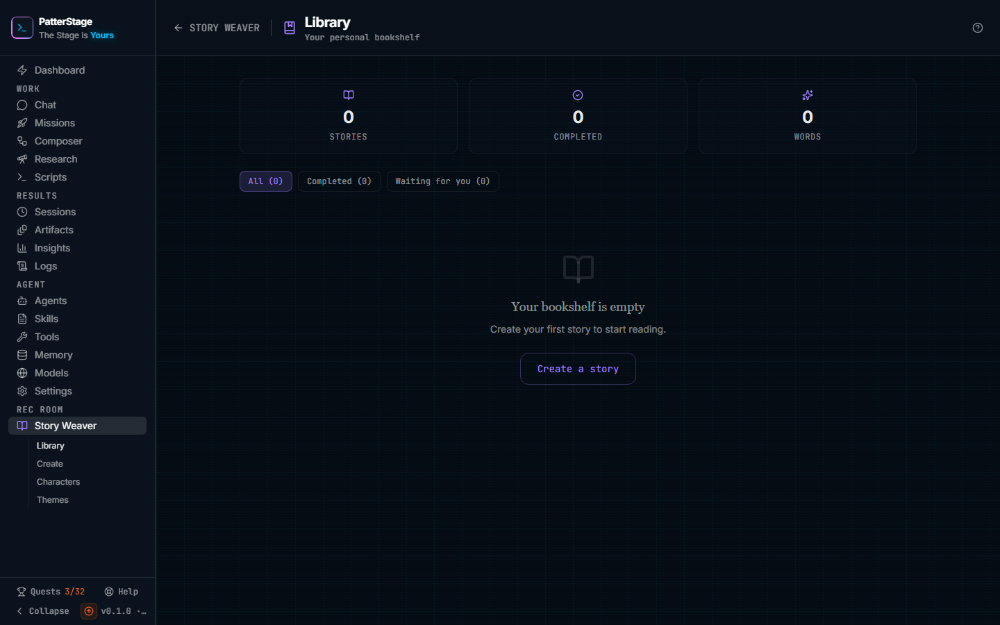

# Story library

Your bookshelf: every story you have started, what state each one is in, and the way back into reading one.

## What you see

The header names the screen Library, with "Your personal bookshelf" under it, a back link marked STORY WEAVER, and the **?** that opens this guide.

Under the header sit three counters, taken from every story you have, not from whatever filter is on: **Stories**, **Completed**, and **Words**, the last being every word written across every chapter of every story.

Then a row of three filter buttons, each carrying its own count: **All**, **Completed**, and **Waiting for you**. One is always on, and it decides which rows the list below shows.

Each story is a row, and the whole row is clickable. A coloured spine runs down its left edge, green once the story is finished and purple while it is not. The row carries:

- the story's title, and under it the genre (or "General" if none was set), the chapters finished out of the chapters planned, the total word count, and an estimated reading time
- a bin button and a status word on the right. The status reads **Completed**, **Running** while a chapter is being written, **Waiting for you** when the story is between chapters, or **Failed**
- the premise, up to two lines, if the story has one
- a thin progress bar, on unfinished stories only, filled to the share of chapters written
- a last line reading "Completed" or "Last updated", with how long ago that was

Hover a row and a small book icon appears at its right edge.

With no stories at all, the list is replaced by "Your bookshelf is empty" and a **Create a story** button. Under a filter that matches nothing, it reads "No stories are completed" or "No stories are waiting for you" instead, with no button. If the list could not be read, a banner takes its place at the top of the page with the reason and a **Retry**.

## Typical use

### Pick up a story you left unfinished

1. Choose the **Waiting for you** filter. What is left is every story that is not finished, each with its progress bar.
2. Click the row. The story opens in the reader at chapter one.
3. Use the chapter list down the left side to get back to where you were. Chapters you have read carry a tick, and chapters not yet written are dimmed and cannot be opened.
4. In the reader's header, **Write chapter 4** (or whichever is next) writes exactly one more chapter. **Keep writing** works through the remaining chapters one after another until they are done or you press **Stop**.

### Reread a finished story, or take it further

1. Choose the **Completed** filter and click a story.
2. Read it with the arrows at the foot of the page, or jump about with the chapter list.
3. On a chapter you want changed, press **Edit**, describe what should be different, and confirm. That chapter is rewritten, and the chapters after it are written again so they still follow on.
4. On a story that has reached its last chapter, **Continue** asks for a direction and how many more chapters you want, then plans and writes them onto the end.

### Clear a story off the shelf

1. Press the bin button on its row. The button turns red and reads **Delete?**.
2. Press it again to confirm. The row leaves the list at once. If you leave it alone for about four seconds it disarms itself and nothing is deleted.

## Notes

Reading costs nothing. Writing a chapter, editing one, or continuing a story is a call to the model that writes it, so each of those takes time and, on a paid provider, money. See [Models](./models.md) and [spend](../concepts/spend.md).

The status words here are the product's single set, and they are the same words the [Story Weaver](./story-weaver.md) hub uses for the same states. The one thing to watch is the second filter: it holds everything that is not finished, so a story showing **Running** or **Failed** turns up under **Waiting for you** as well.

A story counts as completed here once every one of its chapters is written, whether or not the story itself was ever marked finished. That is why the library's Completed count is sometimes one higher than the hub's.

The list is read once, when you open the screen. A story being written in another tab keeps whatever status it had when this page loaded, so leave and come back to see it move on. There is no search and no sort: stories are listed newest first, by when they were created.

Reading time is an estimate at about 250 words a minute, never rounded below one minute.

Deleting hides a story from the library and from the hub. There is no undo on this screen and no bin to restore from, so the story is gone as far as the console is concerned. A backup taken before the deletion still holds it; see [Backups](../running/backup.md).

If the list fails to load, or a delete fails, the banner replaces the whole list rather than showing an empty shelf over an error. **Retry** reads it again.

Stories start on [Create a story](./story-create.md), which is also where saved [characters](./story-characters.md) and [themes](./story-themes.md) get used.

Under the hood

The screen talks to one endpoint, `POST /api/stories`, with `{ action: "list" }` on load and `{ action: "delete", storyId }` on the confirming click.

Stories live in a `stories` table in the console's SQLite database, listed by creation time, newest first. A delete stamps `deleted_at` on the row rather than removing it, and the list skips stamped rows.

The status mapping lives in `src/modules/rec-room/lib/story-status-labels.ts`: `generating` reads Running, `active` reads Waiting for you, `complete` reads Completed, `failed` reads Failed, and a row with no status at all is treated as waiting for you.

Reading time is the row's total chapter word count divided by 250, rounded, with a floor of one minute.

