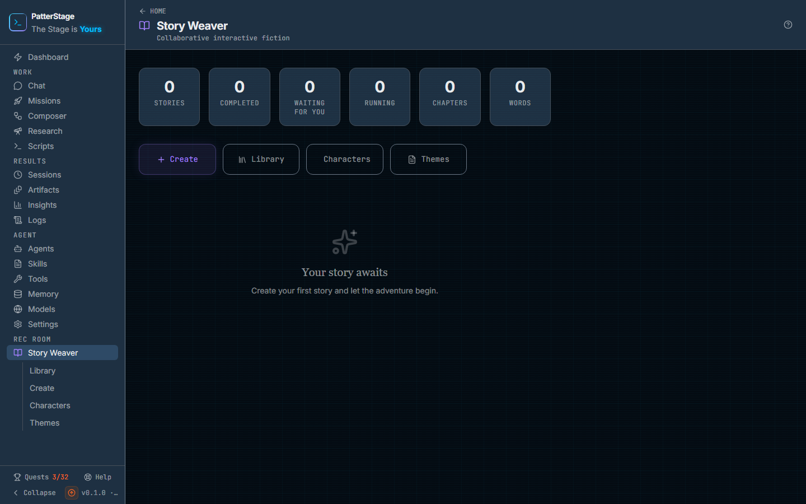

# Story Weaver

The front door to the Rec Room's long-form writer: how much you have written, the
stories you touched most recently, and the way in to the rest of it.

## What you see

The header reads **Story Weaver** with **Collaborative interactive fiction**
beneath it, and a back link reading HOME on the left that returns you to the
dashboard.

Under it, a row of six tiles counted from your stories:

- **Stories**, every story you have that has not been deleted.
- **Completed**, stories whose chapters are all written.
- **Waiting for you**, stories that still have chapters left and will not write
  another until you ask.
- **Running**, stories being generated right now, which in practice means a
  story still on the create screen having its plan and first chapter written.
- **Chapters**, every chapter across every story, written or still pending.
- **Words**, the total word count of the chapters that have been written.

Then four buttons, in this order: **Create**, **Library**, **Characters** and
**Themes**. Create is the highlighted one; the other three are quieter. They go
to the four other Story Weaver screens, which are also listed under Story Weaver
in the sidebar.

Below them, **Recent stories**, showing up to three cards. If you have more than
three, a **View all** link sits at the right of that heading. Each card carries
the story's title, its genre and how long ago it changed, how many of its
chapters are done, and a status word in the top right: Running, Waiting for you,
Completed or Failed. Under that, the first two lines of the premise, then the
word count, a **Read** marker, and a small bin icon for deleting. Clicking
anywhere else on the card opens the story to read.

Before you have written anything, the cards are replaced by an empty state
reading **Your story awaits**, with the line "Create your first story and let
the adventure begin."

If the list of stories cannot be read, a red banner appears at the top of the
page saying so, with a **Retry** button. The empty state is not shown in that
case, so a failed read never looks like an empty shelf.

## Typical use

**Start a story**

1. Click **Create**.
2. Fill in the premise, the characters, the shape of the story and the model
   that writes it, then start it. That screen is covered in
   [create a story](./story-create.md).
3. Creating it takes a few minutes and shows a progress overlay. The plan, the
   chapter list and the whole of chapter one are written in that one step.
4. You land in the reader with chapter one ready to read and the rest pending.

**Carry on with a story you have started**

1. Click the card for it under **Recent stories**, or open **Library** if it is
   not one of the three shown.
2. The reader opens on the story. If chapters are still pending, the header
   offers **Write chapter N**, and **Keep writing** when more than one is left.
3. Click one of them. The chapter's dot in the chapter list turns blue and
   pulses while it is written, and a **Stop** button replaces the write
   controls until the chapter lands or you stop it.
4. Come back here and the tiles have moved: the words are added, and the story
   is back under Waiting for you until you ask again. **Chapters** does not
   change, because it counts the chapters a story is planned to have, written
   or not.

**Get rid of a story**

1. Click the bin icon in the bottom right of its card.
2. The button changes to read **Delete?**. Click it again to confirm. Leave it
   alone for a few seconds and it disarms itself, so a stray first click does
   nothing.
3. The list reloads without it and the tiles drop to match. There is no undo in
   the interface.

## Notes

- **Writing costs money.** Everything else in PatterStage runs on your machine;
  the chapters are written by a model at your provider, so each one is billed.
  One chapter is more than one call: the chapter itself, a short call to give it
  a title, and another to update the running summary that keeps later chapters
  consistent. Creating a story costs about the same, since the plan and the
  first chapter come back from one call and the first summary from a second.
  See [spend](../concepts/spend.md).
- **That cost is counted with everything else.** It appears on
  [Insights](./insights.md) as the **Story Weaver** line in the provider spend
  panel, next to Agent runs, Composer stages and Deep Research, and it counts
  towards a budget you have set there like any other spend. A budget only
  warns, and even the hard stop pauses unattended work rather than a click, so
  nothing here will ever refuse to write a chapter you have asked for. Watch
  the figure yourself.
- **Nothing is written unless you ask for it.** Opening a story does not start a
  chapter. Writing stops when you click **Stop**, and stopping stops the call at
  the provider rather than letting a chapter you will not read finish and bill.
  Closing the tab mid-chapter has the same effect.
- **The status words are the ones used everywhere else in the product.** A story
  is Running while it is being created, Waiting for you once it has chapters
  left to write, Completed when every chapter is done, and Failed when
  generation broke. Writing a later chapter marks the chapter rather than the
  story, so a story keeps its Waiting for you word while a chapter is in
  flight. A failed story is counted in **Stories** but in none of the three
  status tiles, so those three will not always add up to the first.
- **A restart is not resumable.** If PatterStage stops while a chapter is being
  written, that chapter is marked Failed on the next start with the reason
  "Generation was interrupted by a restart. Retry to continue." Nothing is lost
  except that chapter, the story keeps its Waiting for you word, and the reader
  offers a retry for the chapter. A story interrupted while it was still being
  created is marked Failed itself, with the same reason.
- **Recent stories is the three most recently created**, not the three you read
  last. [The library](./story-library.md) has all of them, with filters for
  completed and waiting.
- **Characters and themes are reusable, stories are not.** A character sheet
  saved on [Characters](./story-characters.md) or a premise saved on
  [Themes](./story-themes.md) can be dropped into any new story; a story itself
  is a one-off.
- **Writing feeds your record but not your agents.** Starting a story, writing a
  chapter and finishing a story are recorded, they complete the Rec Room quests
  on [Quests](./quests.md), and they unlock Rec Room achievements. They
  deliberately do not earn an agent any experience, because writing fiction is
  not the agent's work.
- **Stories are local.** They live in the same database as everything else on
  your machine, and they are included in a [backup](../running/backup.md).

Under the hood

Every action on this screen is a POST to `/api/stories` with an `action` field.
The page uses `list` on load and after a delete, and `delete` for the bin icon.
A bare GET on that path is refused on purpose, with a message saying so.

Stories are rows in the `stories` table in the SQLite database, created in the
baseline migration. Deleting sets `deleted_at` rather than removing the row, and
the list query skips deleted rows, so a deleted story is gone from the interface
but the text is still in the database file until you replace it, and a backup
taken afterwards still contains it.

Model calls made for a story are recorded with the spend source `story`, which
is what the Insights panel labels Story Weaver. The model is whichever one was
chosen on the create screen, stored as `modelId` in the story's config; blank
means the agent's default [model](../concepts/model.md).

The counters on this page are computed in the browser from the list response,
not read from a stored total, so they cannot drift from the stories themselves.
The three events that record the work are `story.created`,
`story.chapter_generated` and `story.completed`.

